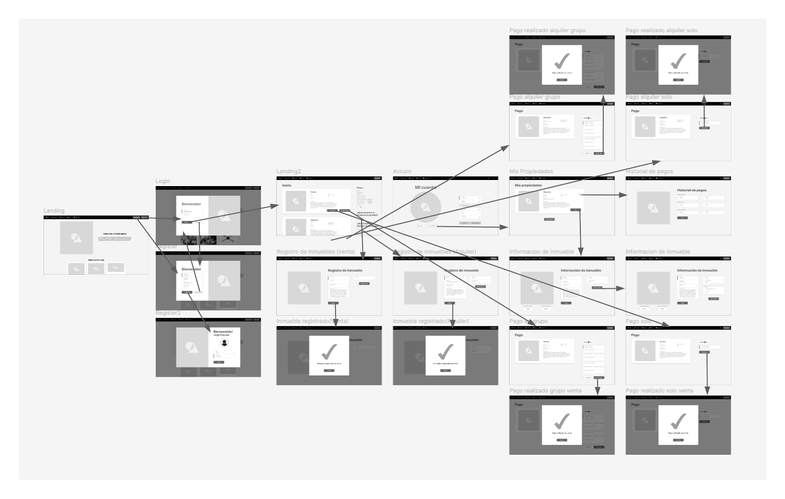
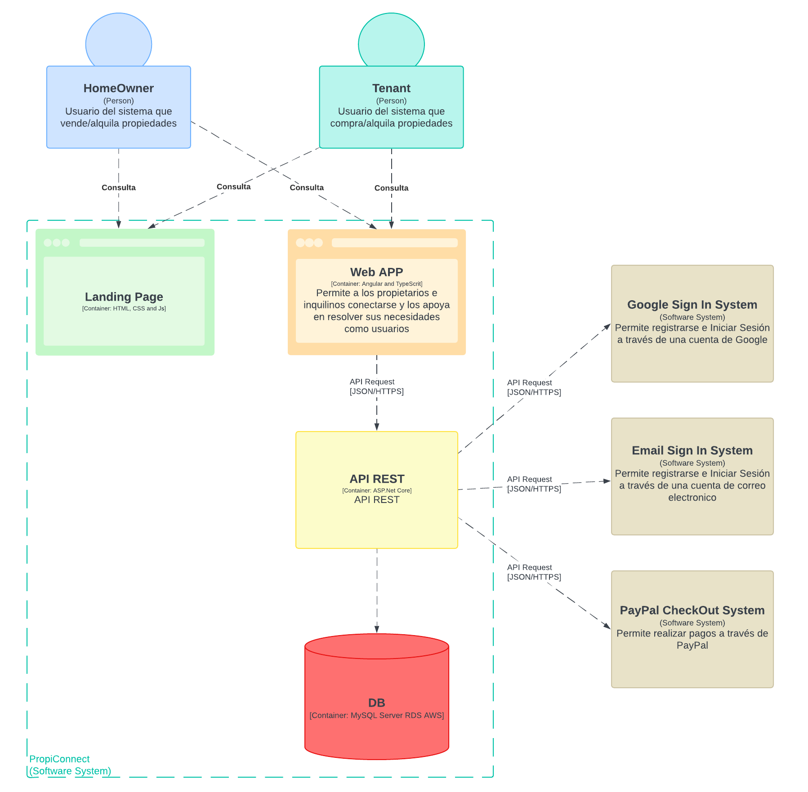

# <center>COURSE PROJECT</center>

<p align="center">
    <strong>Universidad Peruana de Ciencias Aplicadas</strong><br>
    </img><br>
    <strong>Ingeniería de Software</strong><br>
    <strong>Desarrollo de Aplicaciones Open Source - SV51</strong><br>
    <strong>Profesor:  Mori Paiva</strong><br>
    <br>INFORME TRABAJO FINAL
</p>

<center>

#### Startup: **PropiConnect**
#### Product: **InmoShare**

</center>

### <center>Team  Members:</center>
<center>

| Member                           | Code       |
|----------------------------------|------------|
|Antayhua Castillo Oscar Josué     | U20191e414 |
|Del Castillo Bueno Daniel Mateo        | u202211212 |
|       |  |
|  |  |
|              |  |
|          |  |

<br> AGOSTO 2024
</center>  

# Registro de Versiones del Informe
<center>

| Version | Fecha | Autor | Descripcion de Modificacion |
| ----------- | ----------- | ----------- | ----------- |
| 0.0 | 19/03/2024 |Grupo 1 |Se crea el documento |  

</center>

# Project Report Collaboration Insights
[URL del repositorio](https://www.example.com)

(Imagenes de los commits cada entrega)


# Contenido


[Registro de Versiones del Informe](#registro-de-versiones-del-informe)

[Project Report Collaboration Insights](#project-report-collaboration-insights)

[Student Outcome](#student-outcome)

[Capítulo I: Introducción](#capítulo-i-introducción)

[1.1 Startup Profile](#11-startup-profile)  
[1.1.1. Descripción de la Startup](#111-descripción-de-la-startup)  
[1.1.2. Perfiles de integrantes del equipo](#112-perfiles-de-integrantes-del-equipo)  

[1.2. Solution Profile](#12-solution-profile)  
[1.2.1 Antecedentes y problemática](#121-antecedentes-y-problemática)  
[1.2.2 Lean UX Process.](#122-lean-ux-process)  
[1.2.2.1. Lean UX Problem Statements.](#1221-lean-ux-problem-statements)  
[1.2.2.2. Lean UX Assumptions.](#1222-lean-ux-assumptions)  
[1.2.2.3. Lean UX Hypothesis Statements.](#1223-lean-ux-hypothesis-statements)  
[1.2.2.4. Lean UX Canvas.](#1224-lean-ux-canvas)  

[1.3. Segmentos objetivo.](#13-segmentos-objetivo)  

[Capítulo II: Requirements Elicitation & Analysi](#capítulo-ii-requirements-elicitation--analysis)  

[2.1. Competidores](#21-competidores)  
[2.1.1. Análisis competitivo](#211-análisis-competitivo)  
[2.1.2. Estrategias y tácticas frente a competidores](#211-análisis-competitivo)  

[2.2. Entrevistas](#22-entrevistas)  
[2.2.1. Diseño de entrevistas](#221-diseño-de-entrevistas)  
[2.2.2. Registro de entrevistas](#222-registro-de-entrevistas)  
[2.2.3. Análisis de entrevistas](#223-análisis-de-entrevistas)  

[2.3. Needfinding](#23-needfinding)  
[2.3.1. User Personas](#231-user-personas)  
[2.3.2. User Task Matrix](#232-user-task-matrix)  
[2.3.3. User Journey Mapping](#233-user-journey-mapping)  
[2.3.4. Empathy Mapping](#234-empathy-mapping)  
[2.3.5. As-is Scenario Mapping](#235-as-is-scenario-mapping) 

[2.4. Ubiquitous Language](#24-ubiquitous-language)  

[Capítulo III: Requirements Specificatio](#capítulo-iii-requirements-specification)  

[3.1. To-Be Scenario Mapping](#31-to-be-scenario-mapping)    
[3.2. User Stories](#32-user-stories)  
[3.3. Impact Mapping](#33-impact-mapping)  
[3.4. Product Backlog](#34-product-backlog)  

[Capítulo IV: Product Desig](#capítulo-iv-product-design)  

[4.1. Style Guidelines](#41-style-guidelines)  
[4.1.1. General Style Guidelines](#411-general-style-guidelines)  
[4.1.2. Web Style Guidelines](#412-web-style-guidelines)  

[4.2. Information Architecture](#42-information-architecture)  
[4.2.1. Organization Systems](#421-organization-systems)  
[4.2.2. Labeling Systems](#422-labeling-systems)  
[4.2.3. SEO Tags and Meta Tag](#423-seo-tags-and-meta-tags)  
[4.2.4. Searching Systems](#424-searching-systems)   
[4.2.5. Navigation Systems](#425-navigation-systems)  

[4.3. Landing Page UI Design](#43-landing-page-ui-design)   
[4.3.1. Landing Page Wireframe](#431-landing-page-wireframe)  
[4.3.2. Landing Page Mock-up](#432-landing-page-mock-up) 

[4.4. Web Applications UX/UI Design](#44-web-applications-uxui-design)  
[4.4.1. Web Applications Wireframes](#441-web-applications-wireframes)  
[4.4.2. Web Applications Wireflow Diagrams](#442-web-applications-wireflow-diagrams)  
[4.4.2. Web Applications Mock-ups](#442-web-applications-mock-ups)   
[4.4.3. Web Applications User Flow Diagrams](#443-web-applications-user-flow-diagrams)  

[4.5. Web Applications Prototyping](#45-web-applications-prototyping)  

[4.6. Domain-Driven Software Architecture](#46-domain-driven-software-architecture)  
[4.6.1. Software Architecture Context Diagram](#461-software-architecture-context-diagram)  
[4.6.2. Software Architecture Container Diagrams](#462-software-architecture-container-diagrams)  
[4.6.3. Software Architecture Components Diagrams](#463-software-architecture-components-diagrams)  

[4.7. Software Object-Oriented Design](#47-software-object-oriented-design)  
[4.7.1. Class Diagrams](#471-class-diagrams)  
[4.7.2. Class Dictionary](#472-class-dictionary)  

[4.8. Database Design](#48-database-design)  
[4.8.1. Database Diagram](#481-database-diagram)  

[Capítulo V: Product Implementation, Validation & Deploymen](#capítulo-v-product-implementation-validation--deployment)  

[5.1. Software Configuration Management](#51-software-configuration-management)  
[5.1.1. Software Development Environment Configuration](#511-software-development-environment-configuration)  
[5.1.2. Source Code Management](#512-source-code-management)  
[5.1.3. Source Code Style Guide & Conventions](#513-source-code-style-guide--conventions)  
[5.1.4. Software Deployment Configuration](#514-software-deployment-configuration)  

[5.2. Landing Page, Services & Applications Implementation](#52-landing-page-services--applications-implementation)  
[5.2.X. Sprint ](#52x-sprint-n)  
[5.2.X.1. Sprint Planning n](#52x1-sprint-planning-n)  
[5.2.X.2. Sprint Backlog n](#52x2-sprint-backlog-n)  
[5.2.X.3. Development Evidence for Sprint Review](#52x3-development-evidence-for-sprint-review)  
[5.2.X.4. Testing Suite Evidence for Sprint Review](#52x4-testing-suite-evidence-for-sprint-review)  
[5.2.X.5. Execution Evidence for Sprint Review](#52x5-execution-evidence-for-sprint-review)  
[5.2.X.6. Services Documentation Evidence for Sprint Review](#52x6-services-documentation-evidence-for-sprint-review)  
[5.2.X.7. Software Deployment Evidence for Sprint Review](#52x7-software-deployment-evidence-for-sprint-review)  
[5.2.X.8. Team Collaboration Insights during Sprint](#52x8-team-collaboration-insights-during-sprint)  

[5.3. Validation Interviews](#53-validation-interviews)  
[5.3.1. Diseño de Entrevistas](#531-diseño-de-entrevistas)  
[5.3.2. Registro de Entrevistas](#532-registro-de-entrevistas)  
[5.3.3. Evaluaciones según heurísticas](#533-evaluaciones-según-heurísticas)  

[5.4. Video About-the-Product](#54-video-about-the-product)  

[Conclusiones](#conclusiones)  
[Conclusiones y recomendaciones](#conclusiones-y-recomendaciones)  
[Video About-the-Team](#video-about-the-team)  
[Bibliografía](#bibliografía)  
[Anexos](#anexos)  

# Student Outcome
|Criterio Especifico|Acciones Realizadas|Conclusiones|
|-|-|-|
|Participa en equipos multidisciplinarios con eficacia, eficiencia y objetividad, en el marco de un proyecto en soluciones de ingeniería de software.|Compañero1:<br> *TB1:*  Su texto *TB2:* texto etc.. |Su texto de conclusion|
|Conoce al menos un sector empresarial o dominio de aplicación de soluciones de software.|Compañero1:<br> *TB1:*  Su texto<br> *TB2:* texto etc.. |Su texto de conclusion|
# Capítulo I: Introducción
## 1.1. Startup Profile
### 1.1.1. Descripción de la Startup

Dentro del constante cambio del mercado inmobiliario, con propietarios presentando dificultades para conseguir ganancias y personas interesadas en la adquisión de inmuebles siendo sofocados por pésimas opciones de vivienda, surge una necesidad de establecer un vinculo adecuado para concretar esta transacción. 

PropiConnect es una startup diseñada para ser el nexo entre nuestros usuarios, vimos en esta problematica una oportunidad de negocio en la que podemos beneficiar exponencialmente a nuestros usuarios mediante la creación de aplicaciones web dedicadas a conectar nuestro público para que puedan concretar contratos de arrendamiento o venta de propiedades. Nuestra empresa dedicará alma y cuerpo para brindar herramientas utiles para nuestros clientes

**Misión:**

Empoderar a propietarios y compradores mediante una plataforma intuitiva y accesible que facilite la compra, venta y alquiler de inmuebles, al tiempo que fomente la inversión colectiva en bienes raíces. Buscamos simplificar el proceso inmobiliario, ofreciendo herramientas avanzadas y oportunidades de inversión para una experiencia inmobiliaria más equitativa y eficiente.

**Visión:**

Convertirnos en la plataforma líder en el mercado inmobiliario, reconocida por nuestra capacidad para conectar eficientemente a propietarios y compradores, revolucionando la forma en que se gestionan y se invierte en propiedades. Aspiramos a democratizar el acceso al mercado inmobiliario y a proporcionar una solución integral que impulse la transparencia, la colaboración y el éxito en el sector."


#### 1.1.2. Perfiles de integrantes del equipo
|Miembros del equipo | Codigo Estudiante | Carrera | Conocimientos / Habilidades |
|-|-|-|-|
|Daniel Mateo del Castillo Bueno  | u202211212 | Ingenieria de Software | SQL, Angular, Redis, Python, SpringBoot, React, Arduino |
|Oscar Josué Antayhua Castillo 	|U20191e414|Ingenieria de software|C++, python, Arduino, SQL |
|Compañero 3 	|Ingenieria de software|C++, piton .etc|
|Compañero 4 	|U20...|Ingenieria de software|C++, piton .etc|
|Compañero 5 	|U20...|Ingenieria de software|C++, piton .etc|

## 1.2. Solution Profile
### 1.2.1 Antecedentes y problemática
**Antecedentes**

El proceso de compra, venta y alquiler de propiedades suele ser complejo, el volumen de procesos burocráticos obligatorios para conseguir un inmueble es preoupante. La falta de transparencia puede llevar a posibles compradores o arrendados a ser estafados con una vivienda que no existe o está en litigio.

Este sector cuenta tecnología para comprar y vender propiedades, sin embargo ninguno de estos productos brinda una solución integral, por lo que el mercado está abierto a nuevas propuestas de solución de software.


**Problematica**

La necesidad de simplificar el proceso inmobiliario y ofrecer mayores oportunidades de inversión es evidente. La falta de herramientas integradas y transparentes genera una gestión fragmentada y procesos ineficaces que afectan la experiencia del usuario y limitan el acceso a oportunidades de inversión para muchos. Esta situación no solo resulta en una experiencia frustrante para los usuarios, sino que también perpetúa desigualdades en el acceso a la inversión inmobiliaria. La plataforma InmoShare aborda directamente estos desafíos al proporcionar una solución integral que facilita la compra, venta y alquiler de propiedades, al tiempo que ofrece oportunidades de inversión colectiva, democratizando el acceso al mercado inmobiliario y mejorando la eficiencia del proceso.

A continuación utilizaremos el método de "5W 2H" para delimitar las funciones y rango de funciones

 ***What?*** 

 ¿Qué aspectos del proceso de compra y venta de 
 inmuebles buscan mejorar con su solución?

  - La compra y arrendamiento de una propiedad
  - La venta y alquiler de una propiedad

  ***Why?***

 ¿Por qúe es importante una solución como la nuestra en el contexto inmobiliario?

  - Es importante una solución integral como la nuestra, ya que además de la confiabilidad de los usuarios inscritos, las funcionalidades de las demás aplicaciones del mercado acaban antes de que te reunas con el dueño del inmueble. Esto será diferente en nuestro producto debido a que acompañaremos a los usuarios durante más etapas del proceso.

  ***Who?***
  
 ¿Quienes serán nuestros clientes?

  - Interesados en una vivienda (compra o venta).
  - Vendedores o arrendadores de una vivienda

  ***Where?***

 ¿Dónde se implementará nuestra solución para abordar la problemática?

  - Comenzaremos implementando en todo Lima metropolitana.

  ***When?***

 ¿Cúando implementaremos nuestra solución?
  - Tan pronto como el mercado inmobiliario decida que necesitan una alternativa nueva a las soluciones que tienen

 
  ***How?***
 ¿Cómo beneficiamos a los usuarios con nuestra solución?

  - Mediante la implementación de herramientas de publicación y gestión de propiedades, búsqueda y filtros avanzados. Estas herramientas especificas unidas en una sola aplicación web resultarán en una solución integral que evitará que los usuarios se encuentren afectados

  ***How Much?***
 ¿Cuanto costará la aplicación?
  - Obtendremos recursos mediante una suscripción "Pro" y "Enterprise" ambas opciones cuentan con funcionalidades completas, sin embargo la suscripción de enterprise contará con enfoque de valoración de mercado y generación de reportes del mismo

  
 

### 1.2.2 Lean UX Process.
#### 1.2.2.1. Lean UX Problem Statements.

El estado actual del sector de compra y venta de inmuebles se ha centrado principalmente en el manejo de propiedades de manera superficial, de ese modo permitiendo riesgos de estafa por ambas partes.

Los productos que se encuentran en el mercado no logran solucionar esta problematica, solo limitan la interacción de los usuarios.

Nuestro producto abordará este problema mediante una solución, una aplicación web, que permite a los usuarios llevar un mejor manejo de las propiedades de las que son responsables.

Nuestro enfoque inicial serán los dueños de inmuebles y sus clientes potenciales ya sean arrendadores o compradores.

Sabremos que tenemos éxito cuando veamos un aumento en el número de propiedades contactadas, además de un incremento en los usuarios que partician en las oportunidades de inversión colectiva.

#### 1.2.2.2. Lean UX Assumptions.

***Business Assumptions***

  1. Creo que mis clientes necesitan mayor soporte para que puedan desarrollar su proceso de compra/venta de inmuebles de manera más sencilla.
  2. Estas necesidades puedens er satisfechas con una aplicación web, que ofreza una automatización de pedidos
  3. Nuestros clientes iniciales serán vendedores y compradores de inmuebles
  4. El aspecto más importante que se buscará en mi producto, es la gestión de inmuebles y de inquilinos
  5. Nuestro método de generación de recursos será mediante suscripciones con dos planes.
  6. El cliente podrá adquirir beneficios adicionales con la mejora de su suscripción
  7. Voy a conseguir mis clientes mediante publicidad dirigida. 
  8. La competencia en el mercado serán aplicaciones de compra y venta de inmuebles.
  9. Nos destacaremos entre la competencia por nuestra solución moderna, robusta, completa y enfocada en las necesidades de nuestros clientes.
  10. Nuestro mayor riesgo es ser desestimado por la similitud superficial con respecto a otras soluciones del mercado.
  11. Solucionaremos el riesgo mediante la diferenciación del producto. 

***User Assumptions***

  12. Nuestros usuarios serán principalmente dueños de inmuebles que busquen obtener recursos a través de venta o alquiler de estos, además de los posibles inquilinos de los mismos. 
  13. Nuestro producto aborda la necesidad de ambos de nuestros usuarios, por llegar a un acuerdo, mediante nuestra aplicación brindaremos ese vinculo además de encargarnos de las finanzas internas del contrato.
  14. El usuario utilizará nuestro producto antes, durante y despúes del proceso de compra de inmueble.
  15. Las características más importantes de nuestro producto son la interfaz accesible y las herramientas hechas a medida para solucionar los problemas.
  16. Nuestros clientes deben sentirse atraídos por la apariencia de nuestro producto por ello tendremos una interfaz profesional además de ser completamente funcional. 

***Business Outcome Assumptions***
   
  - Conseguir una tasa de renovación de membresías del 70% mensualmente.
  - Aumentar en el número de inmuebles listados en la plataforma en un 50% con respecto al semestre anterior durante el primer año.
  - Conseguir una mejora del 30% a los planes "Enterprise" en el segundo semestre del año de lanzamiento.
  - Recibir una puntuación sobresaliente en el 100% de las encuestas de satisfacción enviadas a los usuarios finalizado el primer año de lanzamiento
 
***User Outcome Assumptions***


  - Cumplir las fechas de pagos relacionados a la vivienda
  - Disminución en el estrés relacionado a las pocas ofertas recibidas por su inmueble
  - Dedicar menos tiempo a la revisión de sus inmuebles
  - Obtener una mejor calidad de vida en un mejor inmueble 
  

***Features***

  - Gestión de pagos relacionados a la vivienda 
  - Gestión nuevos inmuebles
  - Gestión de propiedades 
  - Método de compra compartida
  
#### 1.2.2.3. Lean UX Hypothesis Statements.

***Hypothesis 1:***

**Creemos que lograremos** conseguir una tasa de renovación de membresías del 70% mensualmente

**Si** los buscadores de propiedades

**Logran** cumplir con las fechas del pago relacionado a la vivienda como cuotas, o mensualidades para los inquilinos. 

**Con** la gestión de pagos de alquiler de nuestra aplicación web


***Hypothesis 2:***

**Creemos que lograremos** Aumentar en el número de inmuebles listados en la plataforma en un 50% con respecto al semestre anterior durante el primer año

**Si** los propietarios

**Logran** disminuir el estrés relacionado a las pocas ofertas recibidas por su inmueble

**Con** la gestion de nuevos inmuebles


***Hypothesis 3:***

**Creemos que lograremos** conseguir una mejora del 30% a los planes "Enterprise" en el segundo semestre del año de lanzamiento

**Si** los propietarios

**Logran** Dedicar menos tiempo a la revisión de sus inmuebles

**Con** la gestión de propiedades 


***Hypothesis 4:***

**Creemos que lograremos** recibir una puntuación sobresaliente en el 100% de las encuestas de satisfacción enviadas a los usuarios

**Si** los buscadores de propiedades

**Logran** obtener una mejor calidad de vida en un mejor inmueble 

**Con** método de compra compartida


#### 1.2.2.4. Lean UX Canvas.
(imagen con texto)
## 1.3. Segmentos objetivo.
***Segmento #1:Propietarios de inmuebles***

Aspectos demográficos:
 - Sexo: Masculino o Femenino.
 - Edad: 40-60 años.
 - Estado civil: Variado.

Aspectos geográficos:
 - Que resida y tenga sus viviendas en Lima metropolitana.


Aspectos psicologicos:
 - Intereses: Un comprador honesto con el que pueda llegar a un acuerdo beneficioso para ambos.
 - Valores: Puntualidad, Responsabilidad, Paciencia, Humildad, Asertividad.


***Segmento #2:Buscadores de viviendas***

Aspectos demográficos:
 - Sexo: Masculino o Femenino
 - Edad: 22-35 años
 - Estado civil: Soltero o Casado

Aspectos geográficos:
 - Ubicación de vivienda anterior: Cualquier ciudad del Perú.
 - Ubicación deseada de proxima vivienda: Lima metropolitana, Perú.
 

Aspectos psicologicos:
 - Intereses: Independizarse o mejorar de su antigua vivienda, trabajo
 - Valores: Honestidad, Autosuficiencia, Nula conflictividad,Puntualidad.


---

# Capítulo II: Requirements Elicitation & Analysis
## 2.1. Competidores

**1. AdondeVivir**
<p>Adondevivir es una de las plataformas inmobiliarias más grandes y populares en Perú. Permite a los usuarios buscar propiedades en venta y alquiler, incluyendo departamentos, casas, terrenos, oficinas y locales comerciales.</p>


**2. Urbania**
<p>Urbania es una plataforma líder en el mercado inmobiliario peruano, especializada en la venta y alquiler de inmuebles. Es conocida por su interfaz amigable y su amplia gama de opciones de propiedades.</p>


### 2.1.1. Análisis competitivo.

<table style="text-align:center">
    <tr>
        <th colspan="5">Competitive Analysis Landscape</th>
    </tr>
    <tr>
        <td style="font-weight:bold">¿Por qué llevar a cabo este análisis?</td>
        <td colspan="4">El objetivo de este análisis es entender las características que ofrecen las demás empresas que ofrecen servicios similares al nuestro y así poder compararnos de una manera más clara
        </td>
    </tr>
    <tr>
        <th colspan="2">Competidores</th>
        <th>InmoShare</th>
        <th>AdondeVivir</th>
        <th>Urbania</th>
    </tr>
    <tr>
        <td rowspan="2">Perfil</td>
        <td>Overview</td>
        <td>Nuestra empresa se especializa en el desarrollo de una aplicación web revolucionaria diseñada para simplificar la compra y venta de departamentos. Conectamos compradores y vendedores de manera segura y eficiente, brindando herramientas avanzadas para optimizar cada paso del proceso inmobiliario.</td>
        <td>Adondevivir es una plataforma peruana para comprar y alquilar propiedades, destacada por su amplio catálogo y búsqueda avanzada. Ofrece servicios adicionales como cálculo de hipotecas y simulaciones de préstamos.</td>
        <td>Urbania es una plataforma inmobiliaria en Perú, parte de Navent Group, que ofrece propiedades en venta y alquiler con una interfaz intuitiva y mapas interactivos. Dispone de opciones premium para agentes inmobiliarios.</td>
    </tr>
    <tr>
        <td>Ventaja Competitiva</td>
        <td>Ofrecemos una variedad de alianzas para ofrecer los mejores inmuebles a los mejores precios, además de la opción de compra entre más de una persona</td>
        <td>Ofrece una amplia variedad de propiedades, opciones de publicidad destacada para agentes, herramientas de búsqueda personalizadas y una plataforma consolidada que facilita la conexión rápida entre compradores y vendedores.</td>
        <td>Se destaca por su extenso catálogo de propiedades, interfaz fácil de usar, herramientas de búsqueda avanzadas y contenido informativo que atrae a usuarios interesados en comprar o vender inmuebles en Perú.</td>
    </tr>
    <tr>
        <td rowspan="2">Perfil de Marketing</td>
        <td>Estrategias de Marketing</td>
        <td>Nuestras estrategias de marketing incluyen campañas en redes sociales, SEO, contenido educativo en blogs, alianzas con inmobiliarias, publicidad segmentada y promociones exclusivas para captar y retener usuarios en nuestra plataforma.</td>
        <td>Se enfoca en marketing digital con anuncios en redes sociales y Google Ads. Utiliza contenido informativo sobre el mercado inmobiliario para atraer y educar a los usuarios, además de SEO.</td>
        <td>Utiliza marketing digital con publicidad dirigida y optimización SEO, destacando en redes sociales y motores de búsqueda. También ofrece servicios publicitarios y de marketing para aumentar la visibilidad de las propiedades.</td>
    </tr>
    <tr>
        <td>Mercado Objetivo</td>
        <td>Nuestro mercado objetivo incluye compradores y vendedores de departamentos, tanto nuevos como experimentados, jóvenes profesionales, familias urbanas, inversores inmobiliarios y agentes que buscan una plataforma moderna y eficiente para transacciones inmobiliarias.</td>
        <td>Se dirige a personas en Perú interesadas en comprar o alquilar propiedades, incluyendo jóvenes profesionales, familias y empresarios, así como a agentes y desarrolladores inmobiliarios que buscan promocionar sus ofertas.</td>
        <td>Apunta a compradores y arrendatarios en Perú que buscan propiedades residenciales y comerciales, así como a agentes inmobiliarios y desarrolladores que necesitan visibilidad para sus anuncios y servicios.</td>
    </tr>
    <tr>
        <td rowspan="3">Perfil de Producto</td>
        <td>Productos y Servicios</td>
        <td>Ofrecemos una plataforma intuitiva para la compra y venta de departamentos, con herramientas avanzadas como la opción de poder alquilar o comprar un departamento entre 2 a más amigos.</td>
        <td>Proporciona anuncios inmobiliarios, herramientas de búsqueda avanzada, servicios de cálculo hipotecario, y simulaciones de préstamos para compradores y arrendatarios.</td>
        <td>Ofrece anuncios de venta y alquiler de propiedades, servicios publicitarios premium para agentes, y herramientas de búsqueda avanzada con mapas interactivos.</td>
    </tr>
    <tr>
        <td>Precios y Costos</td>
        <td>Contamos con opciones de publicación gratuitas asi como opciones de paga los cuales ayudan al vendedor a tener publicaciones con mayor visibilidad.</td>
        <td>Tiene opciones de publicación gratuitas y de pago, con tarifas para destacar propiedades y servicios adicionales</td>
        <td>Ofrece publicaciones gratuitas limitadas y paquetes premium de pago para mayor visibilidad de anuncios.</td>
    </tr>
    <tr>
        <td>Canales de Distribución</td>
        <td>Disponible en versión web</td>
        <td>Aplicación móvil y aplicación web</td>
        <td>Aplicación móvil y web</td>
    </tr>
    <tr>
        <td rowspan="4">Analisis SWOT</td>
        <td>Fortalezas</td>
        <td>Plataforma innovadora que facilita la compra y venta de inmuebles, incluyendo la opción de adquirir propiedades en grupo. Ofrece una experiencia de usuario intuitiva y herramientas avanzadas para la gestión de transacciones.</td>
        <td>Amplia variedad de propiedades y fuerte reconocimiento de marca, junto con opciones de publicidad destacada que atraen a agentes y desarrolladores inmobiliarios.</td>
        <td>Amplio catálogo de propiedades y herramientas avanzadas de búsqueda que mejoran la experiencia del usuario, consolidando su posición en el mercado inmobiliario peruano.</td>
    </tr>
    <tr>
        <td>Debilidades</td>
        <td>La novedad del modelo de compra compartida puede generar desconfianza. Requiere un desarrollo tecnológico robusto y costoso, y la necesidad de asegurar la protección legal en transacciones compartidas.</td>
        <td>Alta dependencia del mercado inmobiliario peruano y costos de mantenimiento tecnológico pueden limitar su capacidad de adaptarse a cambios del mercado.</td>
        <td>Competencia intensa y dependencia de la publicidad limitan su crecimiento y capacidad de diferenciación en un mercado saturado de plataformas similares.</td>
    </tr>
    <tr>
        <td>Oportunidades</td>
        <td>Expansión a mercados con alta demanda de bienes raíces y posibilidad de asociarse con agencias y desarrolladores para ofrecer listados exclusivos. Innovación en el mercado inmobiliario y potencial para capturar un segmento nuevo de compradores.</td>
        <td>Innovación en servicios digitales y expansión en América Latina, junto con alianzas estratégicas con agencias inmobiliarias para ofrecer propiedades exclusivas.</td>
        <td>Expansión a mercados latinoamericanos y adopción de tecnologías innovadoras como realidad virtual para ofrecer recorridos virtuales y listados exclusivos de propiedades.</td>
    </tr>
    <tr>
        <td>Amenazas</td>
        <td>Competencia de plataformas establecidas y nuevas startups en el mercado inmobiliario. Riesgos asociados con la legalidad y la gestión de propiedad compartida, así como fluctuaciones económicas que afectan la compra de inmuebles.</td>
        <td>Creciente competencia de nuevos actores y cambios en las preferencias del consumidor, además de la inestabilidad económica que afecta el mercado de bienes raíces.</td>
        <td>Cambios regulatorios y fluctuaciones económicas en el mercado inmobiliario podrían impactar negativamente en su modelo de negocio y rentabilidad.</td>
    </tr>
</table>


### 2.1.2. Estrategias y tácticas frente a competidores.

<ul>
    <li>
        <b>Diferenciación mediante propiedad compartida:</b> Otorgaremos la opción única de comprar inmuebles entre dos o más personas, un servicio que Urbania y Adondevivir no ofrecen. Desarrollaremos campañas de marketing enfocadas en el beneficio de compartir costos y accesibilidad a propiedades que serían inaccesibles para compradores individuales.
    </li>
    <li>
        <b>Mejora de la experiencia del usuario:</b> Invertiremos en una interfaz intuitiva y herramientas avanzadas, como recorridos virtuales en 3D y calculadoras de financiamiento compartido. Esto no solo atraerá a usuarios que buscan innovaciones tecnológicas, sino que también mejorará la retención al ofrecer una experiencia superior.
    </li>
    <li>
        <b>Alianzas estratégicas y listados exclusivos:</b> Colaboraremos con agencias inmobiliarias, desarrolladores, y bancos para obtener listados exclusivos y financiamientos especiales. Ofreceremos incentivos a los agentes para que utilicen la plataforma, diferenciándola por la calidad y exclusividad de las propiedades listadas.
    </li>
</ul>


## 2.2. Entrevistas.
### 2.2.1. Diseño de entrevistas.
**Preguntas generales:**

1. ¿Cuál es su nombre? 
2. ¿Qué edad tiene? 
3. ¿A qué se dedica? 

**Preguntas para vendedores**
1. ¿Cuales son los mayores desafíos que enfentas al vender propiedades actualmente?
2. ¿Cómo te gustaría que una plataforma digital te ayudara a encontrar y conectar con potenciales compradores?
3. ¿Qué características te harían preferir una nueva aplicación sobre las plataformas que usas actualmente?
4. ¿Qué información adicional te gustaría tener sobre los compradores antes de interactuar con ellos?
5. ¿Qué tan frecuente es la venta de propiedades entre varias personas, y cómo se maneja ese proceso actualmente?
6. ¿Hay algo que consideras que falta en las plataformas inmobiliarias actuales? 

**Preguntas para compradores**
1. ¿Qué características te gustaría ver en una plataforma de compra de inmuebles que te facilitarían la búsqueda y decisión de compra? 
2. ¿Qué tan importante es la posibilidad de comprar una propiedad en conjunto con otras personas?
3. ¿Qué tipo de información prefieres tener disponible cuando exploras una propiedad en línea?
4. ¿Qué factores influyen más en tu decisión de comprar una propiedad?
5. ¿Qué problemas has encontrado al utilizar otras plataformas de compra de inmuebles?

### 2.2.2. Registro de entrevistas.
**Segmento 1**  
Nombre: _____
Edad: _ años 
Ocupación: _____  
  
{texto mucho}

**Segmento 2**  
Nombre: _____
Edad: _ años 
Ocupación: _____  

{texto}

### 2.2.3. Análisis de entrevistas.
**Segmento 1:**
{texto}
**Segmento 2:**
{texto}
## 2.3. Needfinding.
### 2.3.1. User Personas.
**Segmento 1:**  


**Segmento 2:**


### 2.3.2. User Task Matrix.
<table>
    <tr>
    <th colspan="3">User Persona: Vendedores de Inmuebles</th>
    </tr>
    <tr>
        <th>Tarea</th>
        <th>Frecuencia</th>
        <th>Importancia</th>
    </tr>
    <tr>
        <td>Crear perfil</td>
        <td>Always</td>
        <td>High</td>
    </tr>
    <tr>
        <td>Gestionar múltiples listados</td>
        <td>Often</td>
        <td>High</td>
    </tr>
    <tr>
        <td>Recibir notificaciones</td>
        <td>Always</td>
        <td>High</td>
    </tr>
    <tr>
        <td>Filtrar compradores</td>
        <td>Sometimes</td>
        <td>Medium</td>
    </tr>
    <tr>
        <td>Agendar visitas</td>
        <td>Always</td>
        <td>High</td>
    </tr>
    <tr>
        <td>Ver analíticas</td>
        <td>Often</td>
        <td>High</td>
    </tr>
    <tr>
        <td>Ver recomendaciones de precios</td>
        <td>Sometimes</td>
        <td>Medium</td>
    </tr>
    <tr>
        <td>Recibir reseñas</td>
        <td>Always</td>
        <td>High</td>
    </tr>
    <tr>
        <td>Ver historial de transacciones</td>
        <td>Always</td>
        <td>High</td>
    </tr>
</table>

<table>
    <tr>
    <th colspan="3">User Persona: Compradores de Inmuebles</th>
    </tr>
    <tr>
        <th>Tarea</th>
        <th>Frecuencia</th>
        <th>Importancia</th>
    </tr>
    <tr>
        <td>Buscar propiedades</td>
        <td>Always</td>
        <td>High</td>
    </tr>
    <tr>
        <td>Guardar propiedades favoritas</td>
        <td>Often</td>
        <td>Medium</td>
    </tr>
    <tr>
        <td>Comparar propiedades</td>
        <td>Sometimes</td>
        <td>Medium</td>
    </tr>
    <tr>
        <td>Calcular financiamiento</td>
        <td>Often</td>
        <td>Medium</td>
    </tr>
    <tr>
        <td>Comprar en grupo</td>
        <td>Often</td>
        <td>High</td>
    </tr>
    <tr>
        <td>Recibir notificaciones</td>
        <td>Always</td>
        <td>High</td>
    </tr>
    <tr>
        <td>Ver recomendaciones personalizadas</td>
        <td>Always</td>
        <td>High</td>
    </tr>
    <tr>
        <td>Gestionar documentos</td>
        <td>Sometimes</td>
        <td>Medium</td>
    </tr>
    <tr>
        <td>Ver historial de búsqueda</td>
        <td>Always</td>
        <td>Medium</td>
    </tr>
</table>

### 2.3.3. User Journey Mapping.
**Registration:**
Why would they trust us?
- s
- s
- s
  
**Onboarding and first use:**
How can they feel successful?
- s
- s
- s  
  
**Sharing:**
Why would they invite others?
- s
- s
- s

### 2.3.4. Empathy Mapping.
**Segmento 1:**


**Segmento 2:**

### 2.3.5. As-is Scenario Mapping.

**Segmento 1**  
Escenario: {escenario}

As Is:
| Fases| Fase 1 | Fase 2| Fase 3| Fase 4|
| -------- | --------- | --------- | ------- | --------- |
| Doing | texto| texto | texto| texto|
| Thinking | texto| texto | texto| texto|
| Feeling  | texto| texto | texto| texto|

**Segmento 2**  
Escenario: Dificultad para entender Matemáticas

As Is:
| Fases| Fase 1 | Fase 2| Fase 3| Fase 4|
| -------- | --------- | --------- | ------- | --------- |
| Doing | texto| texto | texto| texto|
| Thinking | texto| texto | texto| texto|
| Feeling  | texto| texto | texto| texto|
## 2.4. Ubiquitous Language.


# Capítulo III: Requirements Specification
## 3.1. To-Be Scenario Mapping.

Segmento 1:

| Fases                          | Publicar Propiedad | Administrar Propiedades                                       | Crear Contrato de Arrendamiento                              | Generar Informes Financieros                                      |
| ------------------------------ | ------------------ | ------------------------------------------------------------- | ------------------------------------------------------------ | ----------------------------------------------------------------- |
| Doing                         | Subiendo fotos, ingresando descripción y detalles de la propiedad. | Supervisando pagos, renovaciones, y contratos. Gestionando el mantenimiento de las propiedades. | Redactando y revisando los términos del contrato.                 | Reuniendo información financiera para análisis y planificación.  |
| Thinking                      |¿Cómo puedo mostrar mi propiedad de la mejor manera? ¿Será fácil encontrar compradores o arrendatarios? | ¿Todo está al día? ¿Necesito tomar alguna acción? ¿Cómo puedo optimizar la gestión de mis propiedades? | ¿Este contrato cubre todas las situaciones posibles? ¿Será legalmente válido? | ¿Cómo están los ingresos y gastos de mis propiedades? ¿Necesito ajustar mis estrategias de inversión o alquiler? |
| Feeling                       |  Motivado por las posibilidades de generar ingresos.            | Seguro y en control de sus activos. Tranquilo al tener visibilidad completa. | Tranquilo al formalizar el acuerdo con el arrendatario.             | Informado y en control de las finanzas. Preocupado si los informes muestran resultados inesperados.              |


Segmento 2:
| Fases                          | Buscar Propiedad para Alquilar                        | Comprar Propiedad Colectivamente                                  | Recibir Notificaciones de Pago                                      | Renovar Contrato de Alquiler                                       |
| ------------------------------ | ------------------------------------------------------ | --------------------------------------------------------------- | ------------------------------------------------------------------ | ------------------------------------------------------------------ |
| Doing                         | Explorando diferentes propiedades y comparando precios y características. | Evaluando opciones de inversión y calculando retornos potenciales. | Recibiendo y revisando notificaciones, realizando el pago.          | Revisando y negociando los términos del nuevo contrato.            |
| Thinking                      | ¿Esta propiedad cumple con mis necesidades? ¿Es el precio justo? | ¿Esta inversión será rentable? ¿Puedo confiar en los otros compradores? | ¿He recibido la notificación a tiempo? ¿Todo está en orden con los pagos? | ¿Los nuevos términos son justos? ¿Quiero seguir alquilando esta propiedad? |
| Feeling                       | Emocionado por encontrar un lugar adecuado para vivir. | Confiado al invertir en una propiedad con buenas perspectivas.     | Tranquilo al mantenerse al día con los pagos.                       | Decidido si está satisfecho con los términos. Inseguro si los términos no son favorables.                |


## 3.2. User Stories.

## Epic/Story ID: EPIC-001 - Gestión de Propiedades

| **ID**      | **Título**                 | **Descripción**                                                | **Criterios de Aceptación**                                                                                                                                           | **Relacionado con (Epic ID)** |
|-------------|----------------------------|----------------------------------------------------------------|-------------------------------------------------------------------------------------------------------------------------------------------------------------------------|-------------------------------|
| **EPIC-001** | Gestión de Propiedades     | Permitir a los propietarios gestionar sus propiedades, incluyendo el alquiler y la venta. | Given un propietario ha accedido al sistema, when selecciona la opción de gestión de propiedades, then el sistema debe permitirle alquilar o vender la propiedad. |                               |
| **US-001-001** | Alquilar Propiedad          | Como propietario, quiero poder alquilar mi propiedad para recibir ingresos regulares. | Given el propietario tiene una propiedad disponible para alquiler, when selecciona la opción de alquilar, then el sistema debe permitirle fijar el precio del alquiler y establecer las condiciones del contrato. | EPIC-001                      |
| **US-001-002** | Vender Propiedad            | Como propietario, quiero poder vender mi propiedad.            | Given el propietario tiene una propiedad disponible para venta, when selecciona la opción de vender, then el sistema debe permitirle fijar el precio de venta y publicar el anuncio de la propiedad. | EPIC-001                      |
| **US-001-003** | Administrar Pagos de Alquiler | Como propietario, quiero poder verificar si los alquileres se han pagado y recibir recordatorios de pago. | Given el propietario tiene una propiedad en alquiler, when consulta el estado de los pagos, then el sistema debe mostrar los pagos realizados y pendientes, y enviar recordatorios de pago próximos a la fecha. | EPIC-001                      |
| **US-001-004** | Crear Contratos de Alquiler | Como propietario, quiero poder crear contratos para los alquileres de mis propiedades. | Given el propietario ha acordado un alquiler con un inquilino, when crea un contrato, then el sistema debe permitirle generar un contrato que incluya términos de alquiler y condiciones. | EPIC-001                      |
| **US-001-005** | Ver Historial de Contratos | Como propietario, quiero ver el historial de contratos de alquiler para una propiedad. | Given el propietario tiene varios contratos de alquiler, when consulta el historial de contratos, then el sistema debe mostrar una lista de todos los contratos anteriores y sus detalles. | EPIC-001                      |
| **US-001-006** | Editar Detalles de Propiedad | Como propietario, quiero editar los detalles de mi propiedad (ej. descripción, fotos) después de publicarla. | Given el propietario tiene una propiedad publicada, when selecciona la opción de editar, then el sistema debe permitirle modificar los detalles de la propiedad y actualizar la información publicada. | EPIC-001                      |
| **US-001-007** | Verificar Disponibilidad de Propiedad | Como propietario, quiero verificar la disponibilidad de mi propiedad para alquilarla o venderla. | Given el propietario ha publicado una propiedad, when consulta su disponibilidad, then el sistema debe mostrar si la propiedad está disponible para alquiler o venta. | EPIC-001                      |

## Epic/Story ID: EPIC-002 - Gestión de Inquilinos

| **ID**      | **Título**                 | **Descripción**                                                | **Criterios de Aceptación**                                                                                                                                           | **Relacionado con (Epic ID)** |
|-------------|----------------------------|----------------------------------------------------------------|-------------------------------------------------------------------------------------------------------------------------------------------------------------------------|-------------------------------|
| **EPIC-002** | Gestión de Inquilinos      | Permitir a los inquilinos gestionar sus alquileres, incluyendo el pago de alquileres y la recepción de notificaciones. | Given un inquilino ha accedido al sistema, when selecciona la opción de gestión de alquiler, then el sistema debe permitirle pagar el alquiler y recibir notificaciones de pago. |                               |
| **US-002-001** | Pagar Alquiler              | Como inquilino, quiero poder pagar el alquiler de la propiedad que estoy alquilando. | Given el inquilino tiene un alquiler pendiente, when selecciona la opción de pagar, then el sistema debe permitirle realizar el pago de manera segura y confirmar la transacción. | EPIC-002                      |
| **US-002-002** | Recibir Notificaciones de Pago | Como inquilino, quiero recibir notificaciones cuando se acerque la fecha de pago del alquiler y los servicios. | Given el inquilino tiene una fecha de pago próxima, when se acerca la fecha, then el sistema debe enviar notificaciones recordatorias del pago de alquiler y servicios. | EPIC-002                      |
| **US-002-003** | Ver Historial de Pagos      | Como inquilino, quiero ver el historial de mis pagos para asegurarme de que todos los pagos han sido realizados correctamente. | Given el inquilino ha realizado varios pagos, when consulta el historial de pagos, then el sistema debe mostrar todos los pagos realizados y su estado. | EPIC-002                      |
| **US-002-004** | Solicitar Mantenimiento     | Como inquilino, quiero poder solicitar mantenimiento para problemas en la propiedad que estoy alquilando. | Given el inquilino detecta un problema en la propiedad, when solicita mantenimiento, then el sistema debe permitirle enviar una solicitud que incluya detalles del problema. | EPIC-002                      |
| **US-002-005** | Confirmar Recepción de Solicitud de Mantenimiento | Como inquilino, quiero recibir confirmación de que mi solicitud de mantenimiento ha sido recibida y está siendo gestionada. | Given el inquilino ha enviado una solicitud de mantenimiento, when la solicitud es recibida, then el sistema debe enviar una confirmación al inquilino indicando que la solicitud está en proceso. | EPIC-002                      |

## Epic/Story ID: EPIC-003 - Compra Compartida de Propiedad

| **ID**      | **Título**                 | **Descripción**                                                | **Criterios de Aceptación**                                                                                                                                           | **Relacionado con (Epic ID)** |
|-------------|----------------------------|----------------------------------------------------------------|-------------------------------------------------------------------------------------------------------------------------------------------------------------------------|-------------------------------|
| **EPIC-003** | Compra Compartida de Propiedad | Permitir a múltiples personas comprar una propiedad en conjunto y compartir los ingresos de alquiler. | Given un grupo de personas quiere comprar una propiedad en conjunto, when deciden la compra, then el sistema debe permitirles establecer porcentajes de propiedad y distribuir las ganancias de alquiler de acuerdo a estos porcentajes. |                               |
| **US-003-001** | Dividir Propiedad para Compra | Como grupo de compradores, queremos dividir la propiedad en porcentajes de propiedad. | Given un grupo ha decidido comprar una propiedad en conjunto, when definen los porcentajes, then el sistema debe registrar estos porcentajes y asociarlos a cada comprador. | EPIC-003                      |
| **US-003-002** | Distribuir Ganancias de Alquiler | Como grupo de propietarios compartidos, queremos recibir ganancias de alquiler basadas en nuestros porcentajes de propiedad. | Given la propiedad compartida está alquilada, when se recibe el alquiler, then el sistema debe calcular y distribuir las ganancias según los porcentajes establecidos. | EPIC-003                      |
| **US-003-003** | Ver Historial de Distribución de Ganancias | Como grupo de propietarios compartidos, quiero ver un historial de la distribución de las ganancias de alquiler. | Given el grupo de propietarios ha recibido varias distribuciones de ganancias, when consulta el historial, then el sistema debe mostrar un registro detallado de cada distribución realizada. | EPIC-003                      |
| **US-003-004** | Ajustar Porcentajes de Propiedad | Como grupo de compradores compartidos, queremos ajustar los porcentajes de propiedad si es necesario. | Given el grupo de compradores desea ajustar los porcentajes de propiedad, when realizan el ajuste, then el sistema debe actualizar los porcentajes y recalcular la distribución de ganancias. | EPIC-003                      |

## Epic/Story ID: EPIC-004 - Sitio Web Estático

| **ID**      | **Título**                 | **Descripción**                                                | **Criterios de Aceptación**                                                                                                                                           | **Relacionado con (Epic ID)** |
|-------------|----------------------------|----------------------------------------------------------------|-------------------------------------------------------------------------------------------------------------------------------------------------------------------------|-------------------------------|
| **EPIC-004** | Sitio Web Estático         | Crear una landing page que informe a los visitantes sobre el proyecto y las opciones disponibles. | Given un visitante accede a la landing page, when navega por la página, then debe encontrar información clara sobre la compra, alquiler y gestión de propiedades. |                               |
| **US-004-001** | Información sobre Compra y Alquiler | Como visitante, quiero encontrar información sobre cómo comprar o alquilar una propiedad. | Given un visitante accede a la landing page, when navega por la sección de compra y alquiler, then debe encontrar información detallada sobre cómo proceder con cada opción. | EPIC-004                      |
| **US-004-002** | Información de Contacto y Soporte | Como visitante, quiero tener acceso a información de contacto y soporte para resolver dudas. | Given un visitante necesita soporte, when busca información de contacto en la landing page, then debe encontrar datos de contacto y opciones para recibir ayuda. | EPIC-004                      |
| **US-004-003** | Suscripción a Newsletter    | Como visitante, quiero suscribirme a un boletín informativo para recibir actualizaciones y noticias sobre propiedades. | Given un visitante quiere recibir actualizaciones, when se suscribe al boletín informativo, then el sistema debe añadir su dirección de correo a la lista de suscriptores y enviar confirmación de la suscripción. | EPIC-004                      |

### EPIC-005 - Gestión de Nuevos Inmuebles

| **ID**        | **Título**                          | **Descripción**                                                  | **Criterios de Aceptación**                                                                                                                                                                                                                                                                  | **Relacionado con (Epic ID)** |
|---------------|-------------------------------------|------------------------------------------------------------------|----------------------------------------------------------------------------------------------------------------------------------------------------------------------------------------------------------------------------------------------------------------------------------------------|-------------------------------|
| **EPIC-005**  | Gestión de Nuevos Inmuebles          | Permitir a los usuarios agregar nuevos inmuebles al sistema, gestionar documentos legales, actualizar propietarios y realizar un seguimiento de la valorización. | Given un usuario (administrador o propietario) desea agregar un nuevo inmueble al sistema, when completa el formulario de creación del inmueble, then el sistema debe permitirle ingresar toda la información relevante, cargar documentos legales, actualizar información de propietarios y realizar un seguimiento de la valorización del inmueble. |                               |
| **US-005-001** | Agregar Nuevo Inmueble              | Como usuario, quiero agregar un nuevo inmueble al sistema con toda la información relevante. | Given un usuario desea agregar un nuevo inmueble, when completa el formulario de creación del inmueble, then el sistema debe registrar el inmueble con todos los detalles proporcionados, incluyendo dirección, características y fotos. | EPIC-005                      |
| **US-005-002** | Cargar Documentos Legales para Inmueble | Como usuario, quiero cargar documentos legales relacionados con el nuevo inmueble. | Given un usuario ha agregado un nuevo inmueble, when selecciona la opción de cargar documentos legales, then el sistema debe permitirle subir y asociar documentos legales relevantes al inmueble, como escrituras, contratos, etc. | EPIC-005                      |
| **US-005-003** | Actualizar Información de Propietarios | Como usuario, quiero poder actualizar la información de los propietarios de un inmueble si se vende. | Given un inmueble ha sido vendido y tiene nuevos propietarios, when el usuario actualiza la información de propietarios, then el sistema debe permitir modificar la información de los propietarios y actualizar los registros en el sistema. | EPIC-005                      |
| **US-005-004** | Seguimiento de Valorización del Inmueble | Como propietario o administrador, quiero realizar un seguimiento de la valorización del inmueble a lo largo del tiempo. | Given un inmueble está registrado en el sistema, when se ingresan datos de valorización periódicos, then el sistema debe calcular y mostrar un historial de valorización y una tendencia de valorización a lo largo del tiempo, incluyendo gráficos y proyecciones futuras. | EPIC-005                      |
| **US-005-005** | Generar Reportes de Valorización     | Como propietario, quiero generar reportes sobre la valorización histórica del inmueble. | Given un propietario o administrador desea ver el historial de valorización, when solicita un reporte, then el sistema debe generar un informe detallado que muestre la valorización histórica del inmueble, incluyendo gráficos y análisis. | EPIC-005                      |
| **US-005-006** | Notificaciones de Documentación Legal | Como usuario, quiero recibir notificaciones cuando los documentos legales del inmueble necesiten actualización o revisión. | Given documentos legales están asociados a un inmueble, when se acerca la fecha de expiración o revisión de estos documentos, then el sistema debe enviar notificaciones al usuario correspondiente para asegurarse de que se mantengan actualizados. | EPIC-005                      |


## 3.3. Impact Mapping.


## 3.4. Product Backlog.

# Product Backlog

| #Orden | Epic/Story ID | Título                                 | Descripción                                                                                     | Criterios de Aceptación                                                                                                        | Story Points |
|--------|---------------|----------------------------------------|-------------------------------------------------------------------------------------------------|-------------------------------------------------------------------------------------------------------------------------------|--------------|
| 1      | EPIC-001       | Gestión de Propiedades                 | Permitir a los propietarios gestionar sus propiedades, incluyendo el alquiler y la venta.       | Given un propietario ha accedido al sistema, when selecciona la opción de gestión de propiedades, then el sistema debe permitirle alquilar o vender la propiedad. | -            |
| 2      | US-001-001     | Alquilar Propiedad                     | Como propietario, quiero poder alquilar mi propiedad para recibir ingresos regulares.            | Given el propietario tiene una propiedad disponible para alquiler, when selecciona la opción de alquilar, then el sistema debe permitirle fijar el precio del alquiler y establecer las condiciones del contrato. | 5            |
| 3      | US-001-002     | Vender Propiedad                       | Como propietario, quiero poder vender mi propiedad.                                              | Given el propietario tiene una propiedad disponible para venta, when selecciona la opción de vender, then el sistema debe permitirle fijar el precio de venta y publicar el anuncio de la propiedad. | 3            |
| 4      | US-001-003     | Administrar Pagos de Alquiler           | Como propietario, quiero poder verificar si los alquileres se han pagado y recibir recordatorios de pago. | Given el propietario tiene una propiedad en alquiler, when consulta el estado de los pagos, then el sistema debe mostrar los pagos realizados y pendientes, y enviar recordatorios de pago próximos a la fecha. | 8            |
| 5      | US-001-004     | Crear Contratos de Alquiler            | Como propietario, quiero poder crear contratos para los alquileres de mis propiedades.             | Given el propietario ha acordado un alquiler con un inquilino, when crea un contrato, then el sistema debe permitirle generar un contrato que incluya términos de alquiler y condiciones. | 5            |
| 6      | US-001-005     | Ver Historial de Contratos             | Como propietario, quiero ver el historial de contratos de alquiler para una propiedad.            | Given el propietario tiene varios contratos de alquiler, when consulta el historial de contratos, then el sistema debe mostrar una lista de todos los contratos anteriores y sus detalles. | 3            |
| 7      | US-001-006     | Editar Detalles de Propiedad            | Como propietario, quiero editar los detalles de mi propiedad (ej. descripción, fotos) después de publicarla. | Given el propietario tiene una propiedad publicada, when selecciona la opción de editar, then el sistema debe permitirle modificar los detalles de la propiedad y actualizar la información publicada. | 5            |
| 8      | US-001-007     | Verificar Disponibilidad de Propiedad  | Como propietario, quiero verificar la disponibilidad de mi propiedad para alquilarla o venderla.  | Given el propietario ha publicado una propiedad, when consulta su disponibilidad, then el sistema debe mostrar si la propiedad está disponible para alquiler o venta. | 3            |
| 9      | EPIC-002       | Gestión de Inquilinos                  | Permitir a los inquilinos gestionar sus alquileres, incluyendo el pago de alquileres y la recepción de notificaciones. | Given un inquilino ha accedido al sistema, when selecciona la opción de gestión de alquiler, then el sistema debe permitirle pagar el alquiler y recibir notificaciones de pago. | -            |
| 10     | US-002-001     | Pagar Alquiler                         | Como inquilino, quiero poder pagar el alquiler de la propiedad que estoy alquilando.              | Given el inquilino tiene un alquiler pendiente, when selecciona la opción de pagar, then el sistema debe permitirle realizar el pago de manera segura y confirmar la transacción. | 5            |
| 11     | US-002-002     | Recibir Notificaciones de Pago         | Como inquilino, quiero recibir notificaciones cuando se acerque la fecha de pago del alquiler y los servicios. | Given el inquilino tiene una fecha de pago próxima, when se acerca la fecha, then el sistema debe enviar notificaciones recordatorias del pago de alquiler y servicios. | 3            |
| 12     | US-002-003     | Ver Historial de Pagos                 | Como inquilino, quiero ver el historial de mis pagos para asegurarme de que todos los pagos han sido realizados correctamente. | Given el inquilino ha realizado varios pagos, when consulta el historial de pagos, then el sistema debe mostrar todos los pagos realizados y su estado. | 5            |
| 13     | US-002-004     | Solicitar Mantenimiento                | Como inquilino, quiero poder solicitar mantenimiento para problemas en la propiedad que estoy alquilando. | Given el inquilino detecta un problema en la propiedad, when solicita mantenimiento, then el sistema debe permitirle enviar una solicitud que incluya detalles del problema. | 5            |
| 14     | US-002-005     | Confirmar Recepción de Solicitud de Mantenimiento | Como inquilino, quiero recibir confirmación de que mi solicitud de mantenimiento ha sido recibida y está siendo gestionada. | Given el inquilino ha enviado una solicitud de mantenimiento, when la solicitud es recibida, then el sistema debe enviar una confirmación al inquilino indicando que la solicitud está en proceso. | 3            |
| 15     | EPIC-003       | Compra Compartida de Propiedad         | Permitir a múltiples personas comprar una propiedad en conjunto y compartir los ingresos de alquiler. | Given un grupo de personas quiere comprar una propiedad en conjunto, when deciden la compra, then el sistema debe permitirles establecer porcentajes de propiedad y distribuir las ganancias de alquiler de acuerdo a estos porcentajes. | -            |
| 16     | US-003-001     | Dividir Propiedad para Compra          | Como grupo de compradores, queremos dividir la propiedad en porcentajes de propiedad.              | Given un grupo ha decidido comprar una propiedad en conjunto, when definen los porcentajes, then el sistema debe registrar estos porcentajes y asociarlos a cada comprador. | 5            |
| 17     | US-003-002     | Distribuir Ganancias de Alquiler       | Como grupo de propietarios compartidos, queremos recibir ganancias de alquiler basadas en nuestros porcentajes de propiedad. | Given la propiedad compartida está alquilada, when se recibe el alquiler, then el sistema debe calcular y distribuir las ganancias según los porcentajes establecidos. | 8            |
| 18     | US-003-003     | Ver Historial de Distribución de Ganancias | Como grupo de propietarios compartidos, quiero ver un historial de la distribución de las ganancias de alquiler. | Given el grupo de propietarios ha recibido varias distribuciones de ganancias, when consulta el historial, then el sistema debe mostrar un registro detallado de cada distribución realizada. | 5            |
| 19     | US-003-004     | Ajustar Porcentajes de Propiedad       | Como grupo de compradores compartidos, queremos ajustar los porcentajes de propiedad si es necesario. | Given el grupo de compradores desea ajustar los porcentajes de propiedad, when realizan el ajuste, then el sistema debe actualizar los porcentajes y recalcular la distribución de ganancias. | 5            |
| 20     | EPIC-004       | Sitio Web Estático                     | Crear una landing page que informe a los visitantes sobre el proyecto y las opciones disponibles. | Given un visitante accede a la landing page, when navega por la página, then debe encontrar información clara sobre la compra, alquiler y gestión de propiedades. | -            |
| 21     | US-004-001     | Información sobre Compra y Alquiler   | Como visitante, quiero encontrar información sobre cómo comprar o alquilar una propiedad.          | Given un visitante accede a la landing page, when navega por la sección de compra y alquiler, then debe encontrar información detallada sobre cómo proceder con cada opción. | 3            |
| 22     | US-004-002     | Información de Contacto y Soporte      | Como visitante, quiero tener acceso a información de contacto y soporte para resolver dudas.      | Given un visitante necesita soporte, when busca información de contacto en la landing page, then debe encontrar datos de contacto y opciones para recibir ayuda. | 3            |
| 23     | US-004-003     | Suscripción a Newsletter               | Como visitante, quiero suscribirme a un boletín informativo para recibir actualizaciones y noticias sobre propiedades. | Given un visitante quiere recibir actualizaciones, when se suscribe al boletín informativo, then el sistema debe añadir su dirección de correo a la lista de suscriptores y enviar confirmación de la suscripción. | 3            |
| 24     | EPIC-005       | Gestión de Nuevos Inmuebles            | Permitir a los usuarios agregar nuevos inmuebles al sistema, gestionar documentos legales, actualizar propietarios y realizar un seguimiento de la valorización. | Given un usuario (administrador o propietario) desea agregar un nuevo inmueble al sistema, when completa el formulario de creación del inmueble, then el sistema debe permitirle ingresar toda la información relevante, cargar documentos legales, actualizar información de propietarios y realizar un seguimiento de la valorización del inmueble. | -            |
| 25     | US-005-001     | Agregar Nuevo Inmueble                 | Como usuario, quiero agregar un nuevo inmueble al sistema con toda la información relevante.       | Given el usuario desea agregar un nuevo inmueble, when completa el formulario de creación, then el sistema debe permitirle ingresar detalles como ubicación, características, fotos, y documentos legales. | 8            |
| 26     | US-005-002     | Actualizar Información de Propietario  | Como usuario, quiero actualizar la información del propietario del inmueble en el sistema.         | Given el usuario necesita actualizar información del propietario, when realiza los cambios, then el sistema debe guardar y reflejar los nuevos datos del propietario. | 5            |
| 27     | US-005-003     | Gestionar Documentos Legales           | Como usuario, quiero gestionar los documentos legales asociados con los inmuebles.                 | Given el usuario tiene documentos legales para un inmueble, when sube o actualiza estos documentos, then el sistema debe permitirle gestionar y visualizar estos documentos de manera segura. | 5            |
| 28     | US-005-004     | Seguimiento de Valorización            | Como usuario, quiero realizar un seguimiento de la valorización de mis inmuebles a lo largo del tiempo. | Given el usuario quiere monitorear la valorización de un inmueble, when consulta el historial de valorización, then el sistema debe mostrar la evolución del valor del inmueble con gráficos e informes. | 5            |


# Capítulo IV: Product Design
## 4.1. Style Guidelines.
### 4.1.1. General Style Guidelines.
Descripcion del porque estos elementos seran importantes

**Color:** (Descripcion de los colores escogidos y porque)  


**Tipografia:** (Descripcion de la tipografia escogida para el proyecto y porque)

**Branding** (Describir logotipo y porque)

### 4.1.2. Web Style Guidelines.
Descripcion de los elementos que se utilizaran en el web app

**Background:** (primary, secondary, terniary)  

**Text Styles:** (H1, H2, p, a,)  

**Button Styles:** (Button, dropdowns, Switches)

**Icons:** (Fondo blanco con los iconos que vamos a usar)

**Misc** (Cosas como nav var o slideshows que pensemos usar)

## 4.2. Information Architecture.
### 4.2.1. Organization Systems.
Descripcion corta respecto a los sistemas de organizacion que usaremos  (Escoger)
"Hierarchical. This structures advices to present the content in a way to distinguish the level of importance by making use of physical differences, such as size, colour, contrast, alignment etc.

Sequential. Guide users to follow a specific path towards their goal and provide content step-by-step based on the current step. 

Matrix. You can always give the users the option to choose the type of navigation they prefer, i.e. Alphabetical, Chronological, by topic."
### 4.2.2. Labeling Systems.
The labeling system aims at uniting the data effectively and represent them in simple way and avoid confusing great amount of information. A widely adopted way to achieve this is by creating the labels which represent loads of data in few words. 

Como decir "home, about us, etc" basicamente lo que iria en un nav var y asi
### 4.2.3. SEO Tags and Meta Tags

**Meta & SEO (Search Engine Optimization) Tags:**  sirven para que la pagina web sea encontrada facilmente es lo que sale al encontrar la pagina en el buscador (se ponen en el <"head">)
* Titulo: ```<title> ___ </title> ```
* Descripcion: ```<meta name = "description" content = "texto descipcion"/> ```
* Palabras Clave: ```<meta name = "keyword" content = "keyword1, 2 3"/> ```

### 4.2.4. Searching Systems.
**Que se busca?:** Que buscara el usuario  
**Que resultados se mostraran?:** Que se mostrara  
**Interface de busqueda:** Descripcion de como ayuda a encontrar lo deseado 


### 4.2.5. Navigation Systems.
Basicamente aqui definimos como funciona la navegacion del web app
**Hierarchical Navigation System:** Main page a destination pages.
**Global Navigation Systems** (Complemento del Hierachical) Movimiento vertical (te mueves por la pagina)con nav(debe poder regresar a la principal)
**Local Navigation Systems** (vas a otras paginas) (complemento del global nav sistem sub-site) Usas otras paginas
## 4.3. Landing Page UI Design.
### 4.3.1. Landing Page Wireframe.

#### Inicio


#### Servicios


#### Equipo 


#### Planes


#### Testimonios


### 4.3.2. Landing Page Mock-up.


## 4.4. Web Applications UX/UI Design.
### 4.4.1. Web Applications Wireframes.
[Link del figma](https://www.figma.com/design/VsjlXR3dSCZUXkOxLReCdy/WireFrame?m=auto&t=AtBd4Vbri1v7E72Z-6)


<!--  -->
### 4.4.2. Web Applications Wireflow Diagrams.
[Link del LucidChart](https://lucid.app/lucidchart/ab81aedc-cdc3-4a19-8bb2-e78e3361f809/edit?viewport_loc=1995%2C-1401%2C4234%2C1967%2C0_0&invitationId=inv_0049bcb4-df36-4563-a1f4-200ffa80cb12)


<!--  -->
### 4.4.2. Web Applications Mock-ups.
[Link del figma](https://www.figma.com/design/cjHreuImqY0BcTggBOzx5p/Mockup?m=auto&t=AtBd4Vbri1v7E72Z-6)


### 4.4.3. Web Applications User Flow Diagrams.
[Link del LucidCharp](https://lucid.app/lucidchart/93df40ef-a106-4551-8566-efd152394f37/edit?viewport_loc=105%2C86%2C4490%2C2086%2C0_0&invitationId=inv_36f3bd38-1c4a-4f3f-97bd-9039b7660e43)


## 4.5. Web Applications Prototyping.
[URL del Prototipo (Hecho en figma)](https://www.figma.com/design/VsjlXR3dSCZUXkOxLReCdy/WireFrame?m=auto&t=AtBd4Vbri1v7E72Z-6)
[URL del video demostrativo Propotipo](https://upcedupe-my.sharepoint.com/:v:/g/personal/u20191e414_upc_edu_pe/Ed6aAlSBz-dFs9flYGyWdAYB3Lj7ZsznefoC3gwDrZPebg?e=Lfpz0Z&nav=eyJyZWZlcnJhbEluZm8iOnsicmVmZXJyYWxBcHAiOiJTdHJlYW1XZWJBcHAiLCJyZWZlcnJhbFZpZXciOiJTaGFyZURpYWxvZy1MaW5rIiwicmVmZXJyYWxBcHBQbGF0Zm9ybSI6IldlYiIsInJlZmVycmFsTW9kZSI6InZpZXcifX0%3D)
[URL del video demostrativo de la Landing Page](https://upcedupe-my.sharepoint.com/:v:/g/personal/u20191e414_upc_edu_pe/EbY4GmAm4ytCs2vozXOX7QIBxFYHk7sACTJyRimxy5S2dQ?e=vzSloV&nav=eyJyZWZlcnJhbEluZm8iOnsicmVmZXJyYWxBcHAiOiJTdHJlYW1XZWJBcHAiLCJyZWZlcnJhbFZpZXciOiJTaGFyZURpYWxvZy1MaW5rIiwicmVmZXJyYWxBcHBQbGF0Zm9ybSI6IldlYiIsInJlZmVycmFsTW9kZSI6InZpZXcifX0%3D)


## 4.6. Domain-Driven Software Architecture.
### 4.6.1. Software Architecture Context Diagram.


### 4.6.2. Software Architecture Container Diagram.



### 4.6.3. Software Architecture Component Diagram.

API Rest Component Diagram:


User Bounded Context Component Diagram:


Content Bounded Context Component Diagram:


Service Bounded Context Component Diagram:


Monetization Bounded Context Component Diagram:


## 4.7. Software Object-Oriented Design.
### 4.7.1. Class Diagrams.
Esta yaselasaben (diagrama de clases)
Clases(name), objetos(nombre-objeto [como objeto]), metodos("Accion") y atributos(Correo, edad,nombre como valor, ID)
### 4.7.2. Class Dictionary.
Inherit (ave(superclase) -> (subclase)canario )
Polymorphism (Ej. funcion de persona hablar() -> Peruano hablar() , Gringo hablar() todos tienen una funcion que contiene persona y van cambiando sus formas)
Abstraction (Ej. Solo muestra el usuario, pero esta su edad, correo y veces usada que uso app en la base de datos (fuera de vista))
Encapsulation (cuando tienes tus variables y metodos en la misma clase las estas encapsulando, aun mas se encapsulan en Private y Public )
## 4.8. Database Design.
### 4.8.1. Database Diagram.
Diagrama de base de datos (la relacion entre clases PK FK el Normalizar tmbn, isiyisi 🕸)
# Capítulo V: Product Implementation, Validation & Deployment
## 5.1. Software Configuration Management.
### 5.1.1. Software Development Environment Configuration.
Especificaciones de donde vamos a hacer el proyecto (vscode supongo)
extensiones tmbn? nose bn q quieren aca
### 5.1.2. Source Code Management.
El gitjab donde tengamos el proyecto
### 5.1.3. Source Code Style Guide & Conventions.
Que usamos con css (en caso usemos software para SASS)
supongo q tmbn cositas de como hacemo el code capas algun tipo de codigo para comunicarse entre comments
### 5.1.4. Software Deployment Configuration.
Configuraciones de donde y como deployeamos el proyecto
## 5.2. Landing Page, Services & Applications Implementation.
### 5.2.X. Sprint n
#### 5.2.X.1. Sprint Planning n.
Explicar como vamos a plannear el sprint?
#### 5.2.X.2. Sprint Backlog n.
 Nica hago la tabla 
#### 5.2.X.3. Development Evidence for Sprint Review.

#### 5.2.X.4. Testing Suite Evidence for Sprint Review.

#### 5.2.X.5. Execution Evidence for Sprint Review.

#### 5.2.X.6. Services Documentation Evidence for Sprint Review.

#### 5.2.X.7. Software Deployment Evidence for Sprint Review.

#### 5.2.X.8. Team Collaboration Insights during Sprint.
 imagenes de colaboraciones github

## 5.3. Validation Interviews.
### 5.3.1. Diseño de Entrevistas.
**Preguntas generales:**

1. ¿Cuál es su nombre? 
2. ¿Qué edad tiene? 
3. ¿A qué se dedica? 
4. ¿[Opinion de idea de propuesta]? 

**Entrevistas usuario segmento 2**
1. ¿Lorem?
2. ¿Lorem?
3. ¿Lorem?
4. ¿Lorem?  
   
**Entrevistas usuario segmento 2**
1. ¿Lorem? 
2. ¿Lorem?
3. ¿Lorem?
4. ¿Lorem? 
### 5.3.2. Registro de Entrevistas.
**Segmento 1**  
Nombre: _____
Edad: _ años 
Ocupación: _____  
  
{texto mucho}

**Segmento 2**  
Nombre: _____
Edad: _ años 
Ocupación: _____  

{texto}
### 5.3.3. Evaluaciones según heurísticas.
| HEURÍSTICA   | EVALUACIÓN ✅❌ | NOTA      |
| --------------------------------------------- | ---------- | --------- |
| Visibilidad del estado del sistema            |            | {texto}   |
| Coincidencia entre el sistema y el mundo real |            | {texto}   |
| Control y libertad del usuario                |            | {texto}   |
| Consistencia y estándares                     |            | {texto}   |
| Prevención de errores                         |            | {texto}   |
| Mostrar antes que recordar                    |            | {texto}   |
| Flexibilidad y eficiencia de uso              |            | {texto}   |
| Diseño estético y minimalista                 |            | {texto}   |
| Comunicar errores con facilidad               |            | {texto}   |
| Ayuda y documentación                         |            | {texto}   |
## 5.4. Video About-the-Product.
[URL del video about the product](https://www.example.com)
# Conclusiones
{texto}
# Conclusiones y recomendaciones.
{texto}
# Video About-the-Team.
[URL del video about the team](https://www.example.com)

# Bibliografía
qoomon. (2021, 11 enero). Conventional Commit Messages. Gist.
Recuperado 20 de junio de 2022, de [LINK](https://gist.github.com/qoomon/5dfcdf8eec66a051ecd85625518cfd13)

LeaseIN. (2018). Importancia de contar con un equipo de soporte
técnico. [Entrada en blog]. Recuperado de:
[LINK](https://leasein.pe/blog/branding-empresarial-importanciasoporte-tecnico/)
``` 
formato

"Apellido", Ini.Ciales. & "otroAutor", O.A. (año). titulo del articulo.
        "nombre del articulo o lo q sea, Volumen(si es que tiene), numero  de pagina"#-#. https//link.org/eeeseneko

```
# Anexos

datos, gráficos, imágenes, esquemas, mapas o referencias de otros autores


#
